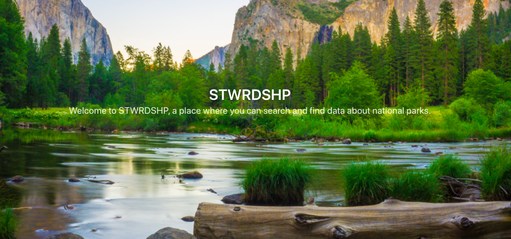

# STWRDSHP
A small app that displays, searches, and favorites National Parks.

If you enjoy national parks in the United States and want a way to quickly search and favorite them, this app is for you.

# Installation
### Rails backend
In order to get started, clone this repository.

Navigate to the `stwrdshp-backend` directory and run:
```
bundle install
```

#### JWT Secret
We need to set up a secret to use with [JWT](https://jwt.io/). Create a `.env` file:
```
touch .env
```
Then generate a random string:
```
ruby -e "require 'securerandom'; puts SecureRandom.hex"
```
Paste the output of the above command into your `.env` file and assign it to a `SESSION_SECRET` variable, **without quotes**, e.g.:
```
JWT_KEY=7b49a653d252d97eb156f7ee0409c5c8
```

#### NPS API Key
In order to use this locally, you'll need your own NPS API key. Follow the instructions [here](https://www.nps.gov/subjects/developer/get-started.htm) to set one up, which should happen instantly.

Once you have the key, replace `YOUR_API_KEY` in `stwrdshp-backend/Rakefile` with your key:
```
stwrdshp-backend/Rakefile:12:
uri = URI.parse('https://developer.nps.gov/api/v1/parks?api_key=[YOUR_API_KEY]]&limit=700')
```
Once that's done, you can set up the database.

#### Backend database
Now, set up the database:
```
rake db:migrate
```
To load the backend database with [NPS](https://www.nps.gov/index.htm) data, run:
```
rake db:load
```
This make take a few seconds as it's creating a new `Park` record for every national park in the United States.

Now we can start the server:
```
rails s
```
This will start a Rails web server at [http://localhost:3000](http://localhost:3000). Keep this running in a terminal window.

### React frontend
Navigate to the `stwrdshp-frontend` directory and run the frontend server:
```
npm start
```
This will start the frontend web server at [http://localhost:3001](http://localhost:3001). You should be able to see the app now!

# Contribution
Pull requests are not only welcome, they're encouraged! For major changes, please open an issue first to discuss what you would like to change.

* * *

# Demo
Demo: https://www.youtube.com/watch?v=JM5QxQKRFQ4

# License
[MIT](./LICENSE)
